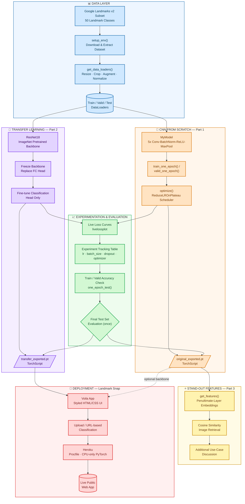

<div align="center">

# Landmark Classification & Tagging for Social Media

**Automatically identify landmarks in photos to recover missing location metadata — from a from-scratch CNN, to transfer learning, to a live deployed app.**


</div>

---

## Overview

Photo-sharing and photo-storage platforms rely heavily on GPS metadata to power features like automatic album organization, location-based search, and smart tagging. A large share of uploaded photos, however, arrive with **no usable location metadata** — stripped by messaging apps, absent from GPS-less cameras, or lost during re-export. This project builds a system that recovers that missing signal directly from the pixels of the photo: by recognizing a landmark in the image, it infers the most likely location.

The project follows the complete applied machine learning lifecycle:

1. **Data preprocessing** — building a robust, augmented image pipeline for a 50-class landmark dataset
2. **Model development** — a convolutional neural network built entirely **from scratch**, and a second model built via **transfer learning** on a pretrained ResNet18
3. **Disciplined experimentation** — validation-driven hyperparameter tuning, with the test set touched only once
4. **Deployment** — the winning model shipped as **Landmark Snap**, a styled, publicly deployable web app served with [Voilà](https://voila.readthedocs.io/) and hosted on [Heroku](https://www.heroku.com/)

A full write-up of the methodology, results framing, business value, and limitations is available in [`Landmark_Classification_Project_Report.docx`](#-full-project-report).

---

## Table of Contents

- [Overview](#-overview)
- [Key Features](#-key-features)
- [Project Structure](#-project-structure)
- [Architecture](#-architecture)
- [Dataset](#-dataset)
- [Getting Started](#-getting-started)
- [Usage](#-usage)
- [Model Performance Targets](#-model-performance-targets)
- [Experiment Tracking](#-experiment-tracking)
- [Stand-Out Features](#-stand-out-features)
- [Landmark Snap — Deployment](#-landmark-snap--deployment)
- [Testing](#-testing)
- [Limitations](#-limitations)
- [Future Work](#-future-work)
- [Full Project Report](#-full-project-report)
- [Acknowledgments](#-acknowledgments)

---

## Key Features

- **Two complete modeling approaches**, trained and compared under one consistent methodology:
  - A 5-block convolutional neural network built **from scratch** (`src/model.py`)
  - A **transfer-learning** model on a frozen, ImageNet-pretrained ResNet18 backbone (`src/transfer.py`)
- **Reproducible preprocessing pipeline** with train-time augmentation and dataset-derived normalization (`src/data.py`)
- **Disciplined experiment tracking**: live loss/accuracy curves, an in-notebook experiment log, and a strict validation-only tuning policy before any test-set evaluation
- **Content-based image retrieval** stand-out feature, using the CNN's learned feature embeddings and cosine similarity
- **TorchScript export** for both models — a single, self-contained artifact bundling weights, preprocessing, and class names
- **Landmark Snap**: a fully styled, deployable [Voilà](https://voila.readthedocs.io/) web app with upload *and* URL-based classification, engineered around a real cross-version `ipywidgets` compatibility bug
- **One-command Heroku deployment**, with a CPU-only PyTorch dependency strategy tuned to fit Heroku's slug size and memory limits
- **Automated test suite** (`pytest`) covering the data pipeline, both model architectures, optimizers, and the training/evaluation loop

---

## Project Structure

```
proj/
├── Project_Landmarks_Part1_CNNfromScratch__starter.ipynb   # Build & train the from-scratch CNN
├── Project_Landmarks_Part2_TransferLearning__starter.ipynb # Build & train the ResNet18 transfer model
├── Project_Landmarks_Part3_App__starter.ipynb               # Interactive exploration + stand-out demos
│
├── src/                          # Core, importable, pytest-covered package
│   ├── data.py                   #   get_data_loaders(), visualize_one_batch()
│   ├── model.py                  #   MyModel — CNN from scratch + get_features() for retrieval
│   ├── optimization.py           #   get_loss(), get_optimizer()
│   ├── train.py                  #   train_one_epoch(), valid_one_epoch(), optimize(), one_epoch_test()
│   ├── transfer.py                #   get_model_transfer_learning() — frozen ResNet18 + new head
│   ├── predictor.py               #   Predictor — TorchScript-exportable inference wrapper
│   └── helpers.py                 #   Dataset download, mean/std computation, misc utilities
│
├── heroku_app/                    # Standalone, deployable "Landmark Snap" application
│   ├── app.ipynb                  #   Styled Voilà app (upload + URL-based classification)
│   ├── requirements.txt           #   CPU-only PyTorch + Voilà + ipywidgets
│   ├── Procfile                   #   Heroku process definition
│   ├── .python-version            #   Pinned Python runtime for Heroku's buildpack
│   ├── checkpoints/                #   (you add your exported .pt model here before deploying)
│   └── README.md                  #   Deployment-specific walkthrough & troubleshooting
│
├── static_images/                 # Icons and sample images used inside the notebooks
├── requirements.txt                # Training-environment dependencies
├── pytest.ini                      # Test discovery configuration
└── landmark_classification_project_report.docx   # Full written project report
```

---

## Architecture

The diagram below shows the complete data-science flow implemented in this project, from raw data through both modeling paths, into evaluation, the stand-out extensions, and finally deployment. Each stage of the pipeline is grouped and color-coded by role.



**Reading the diagram:** the blue **Data Layer** feeds both modeling paths in parallel — the orange **CNN From Scratch** path and the purple **Transfer Learning** path. Both converge on the green **Experimentation & Evaluation** stage, where hyperparameters are tuned exclusively against validation performance before a single, final test-set pass. The from-scratch model's exported weights also feed the yellow **Stand-Out Features** (image retrieval via feature embeddings), while the transfer-learning model's export is what powers the red **Deployment** stage — Landmark Snap.

### Model architecture details

| | From-Scratch CNN (`MyModel`) | Transfer Learning (`ResNet18`) |
|---|---|---|
| Backbone | 5x [Conv2d → BatchNorm2d → ReLU → MaxPool2d], channels 3→16→32→64→128→256 | ImageNet-pretrained ResNet18, **fully frozen** |
| Classifier head | Flatten → Linear(12544→512) → BatchNorm1d → ReLU → Dropout(p) → Linear(512→50) | New `Linear(num_ftrs, 50)` replacing the original 1000-way `fc` layer |
| Trainable parameters | All layers | Only the new final linear layer |
| Loss | `nn.CrossEntropyLoss` | `nn.CrossEntropyLoss` |
| Optimizer | SGD or Adam (compared per experiment) | SGD or Adam (compared per experiment) |
| LR schedule | `ReduceLROnPlateau` (factor 0.1, patience 3) | `ReduceLROnPlateau` (factor 0.1, patience 3) |
| Export | `checkpoints/original_exported.pt` (TorchScript) | `checkpoints/transfer_exported.pt` (TorchScript) |

---

## Dataset

- **Source**: a curated 50-class subset of the Google Landmarks dataset (e.g. Golden Gate Bridge, Eiffel Tower, Machu Picchu, Atomium, Haleakala National Park), downloaded on demand via `setup_env()` rather than committed to the repository.
- **Splits**: pre-defined `train/` and `test/` directories; the training directory is further split at load time into training and validation subsets (80/20 by default) using `SubsetRandomSampler`, so validation data is drawn from the same pool as training but is never used to update model weights.
- **Preprocessing**: every image is resized (shorter side to 256px) then cropped to 224×224. Training images additionally receive random cropping, horizontal flipping, ±10° rotation, and mild color jitter; validation/test images use a plain center crop with no augmentation.
- **Normalization**: per-channel mean/std are computed directly from the training data (cached to `mean_and_std.pt`) rather than assumed from ImageNet statistics.

---

## Getting Started

### Prerequisites
- Python 3.9+
- (Optional but recommended) a CUDA-capable GPU — training also runs on CPU, just considerably slower

### Installation

```bash
# Clone / unzip the project, then:
conda create --name landmarks -y python=3.10
conda activate landmarks

cd proj
pip install -r requirements.txt
pip install jupyterlab

# Confirm GPU visibility (optional)
python -c "import torch; print(torch.cuda.is_available())"
```

---

## Usage

Run the notebooks in order:

1. **`Project_Landmarks_Part1_CNNfromScratch__starter.ipynb`**
   Explore the data, build `MyModel` from scratch, tune hyperparameters against validation performance (see [Experiment Tracking](#-experiment-tracking)), evaluate once on the test set, and export to TorchScript.
   *Target: ≥50% test accuracy (stand-out: >60%).*

2. **`Project_Landmarks_Part2_TransferLearning__starter.ipynb`**
   Load a pretrained ResNet18, freeze the backbone, train a new classification head, evaluate, and export.
   *Target: ≥60% test accuracy (stand-out: >80%).*

3. **`Project_Landmarks_Part3_App__starter.ipynb`**
   Interactive upload-and-classify widget, a non-interactive reproducible test-image cell, the image-retrieval stand-out demo, and a discussion of additional use cases.

Then, to run the deployable app locally:

```bash
cd heroku_app
cp ../checkpoints/transfer_exported.pt checkpoints/
pip install -r requirements.txt
voila app.ipynb --show_tracebacks=True
```

---

## Model Performance Targets

| Model | Minimum (pass) | Stand-out target |
|---|---|---|
| CNN from scratch | ≥ 50% test accuracy | > 60% test accuracy |
| Transfer learning (ResNet18) | ≥ 60% test accuracy | > 80% test accuracy |

> Final accuracy numbers depend on your own training run (hardware, chosen hyperparameters, and number of epochs). Use the train/validation accuracy cells added before each model's test-evaluation step to track your results against these targets before running the test set.

---

## Experiment Tracking

Two complementary mechanisms are used throughout training, in both Part 1 and Part 2:

- **Live convergence monitoring** — `livelossplot` renders training/validation loss and learning rate after every epoch, making overfitting (diverging train/valid loss), underfitting (both losses plateauing high), and scheduler-driven convergence (repeated LR drops with no further improvement) immediately visible.
- **Cross-run comparison table** — a markdown table, positioned directly before each model's final test-set evaluation step, logs hyperparameters (batch size, learning rate, optimizer, weight decay, dropout/backbone) alongside resulting train/validation loss, accuracy, and free-text notes for every configuration tried.

The test set is evaluated **exactly once**, only after a configuration has already been selected using validation performance alone — never used to guide tuning decisions.

---

## Stand-Out Features

1. **Experiment tracking discipline** — described above, implemented identically for both models.
2. **Content-based image retrieval** — `MyModel.get_features()` exposes the CNN's 512-dimensional penultimate-layer embedding. Given a query image, its normalized embedding is compared via cosine similarity against a gallery of test-set images, surfacing the most visually similar results — independent of predicted class label.
3. **Additional use-case discussion** — a written exploration of adjacent applications (album auto-organization, travel apps, content moderation, dataset curation) and an explicit statement of the model's closed-set limitations.
4. **Landmark Snap deployment** — the most substantial stand-out; see below.

---

## Landmark Snap — Deployment

`heroku_app/` contains a fully standalone, deployable version of the app — decoupled from `src/`, since the exported TorchScript model already bundles the trained weights, preprocessing transforms, and class names.

**Highlights:**
- Custom CSS styling (gradient banner, card layout, animated probability bars) injected directly into notebook output
- Robust upload handling that transparently supports both the ipywidgets 7.x (`.data`) and 8.x (`.value`) `FileUpload` APIs
- A URL-based classification fallback for environments (e.g. some VS Code Jupyter setups) where binary file-upload syncing is unreliable
- A CPU-only PyTorch dependency strategy (`--extra-index-url https://download.pytorch.org/whl/cpu`) to fit Heroku's slug size limit
- `.python-version` (not the deprecated `runtime.txt`) to pin the Heroku Python runtime

**Deploy it yourself:**

```bash
cd heroku_app
cp /path/to/your/transfer_exported.pt checkpoints/
git init && git add . && git commit -m "Landmark Snap"
heroku create your-app-name
git push heroku main
heroku ps:scale web=1
heroku open
```

See [`heroku_app/README.md`](heroku_app/README.md) for full setup, troubleshooting (memory limits, boot timeouts, slug size), and customization notes.

---

## Testing

The `src/` package is covered by an automated `pytest` suite (see `pytest.ini`), embedded directly inside each module:

```bash
pytest src/data.py
pytest src/model.py
pytest src/optimization.py
pytest src/train.py
pytest src/transfer.py
pytest src/predictor.py
```

Each notebook also runs these tests inline as part of its workflow, so a broken change to `src/` surfaces immediately, before any time is spent training.

---

## Limitations

- **Closed-set classification** — the model can only output one of its 50 trained classes; it has no built-in "not a known landmark" rejection mechanism, so an unfamiliar landmark will still be confidently (and incorrectly) assigned one of the 50 labels.
- **Sensitivity to image conditions** — performance depends on how closely a new photo's lighting, angle, and framing resemble the training distribution.
- **Class imbalance** — the dataset is not perfectly balanced, and per-class accuracy likely varies more than the aggregate test accuracy suggests.
- **CPU-only deployment** — appropriate for interactive, single-image latency, but not optimized for high-throughput batch inference.
- **Retrieval gallery scale** — the image-retrieval stand-out searches a small, randomly sampled gallery for latency reasons, not a full, indexed collection.

A more complete discussion is in the [full project report](#-full-project-report).

---

## Future Work

- Open-set / out-of-distribution rejection (confidence thresholding or a dedicated "unknown" class)
- Larger or different backbones (EfficientNet, Vision Transformers) or partial backbone fine-tuning
- Zero-/few-shot approaches (e.g. CLIP) to extend beyond the fixed 50-class ceiling
- Dataset expansion — more classes, more images per class, richer geographic metadata
- Formal experiment-tracking platform (MLflow / Weights & Biases) in place of the notebook table
- Approximate-nearest-neighbor indexing (e.g. FAISS) to scale image retrieval to a real photo collection
- Model compression (quantization, pruning, distillation) for lower-latency, lower-memory deployment

---

## Full Project Report

A comprehensive written report — Executive Summary, Problem Statement, Dataset, Solution Statement, Architecture, Experiment Tracking Systems, Stand-Outs, Landmark Snap Deployment, Conclusion, Value Statement, Limitations, Direction of Future Research, and References — is available at:

📘 [`Landmark_Classification_Project_Report.pdf`](./Landmark_Classification_Project_Report.pdf)

---

## Acknowledgments

- Project specification, starter codebase, and dataset subset adapted from Udacity's *Landmark Classification & Tagging for Social Media*
- [He et al., 2016 — Deep Residual Learning for Image Recognition](https://arxiv.org/abs/1512.03385) (ResNet)
- [Deng et al., 2009 — ImageNet](https://ieeexplore.ieee.org/document/5206848)
- [PyTorch](https://pytorch.org/) and [torchvision](https://pytorch.org/vision/stable/index.html)
- [Voilà](https://voila.readthedocs.io/) for turning the trained model into a deployable app
- [Heroku](https://www.heroku.com/) for hosting

